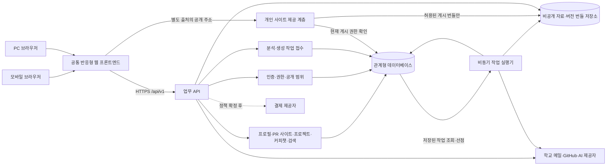

# 두드리 통합 아키텍처 초안

> 기준: [blueprint.md](./blueprint.md) → [ERD.md](./ERD.md) → [API_SPEC.md](./API_SPEC.md). 기획의 사용자 경험을 우선하고, ERD는 논리 데이터 모델, API 명세는 목표 계약으로 사용한다. 이 문서는 현재 구현 완료 상태를 뜻하지 않는다.

## 1. 목표와 설계 원칙

두드리는 검증 가능한 소속을 바탕으로 같은 학교 선후배의 경험 공유·커리어 탐색·커피챗·프로젝트 참여를 연결하는 서비스. 프론트엔드와 백엔드에서 **승인된 사실**, **공개 가능한 사실**, **내부 매칭에 사용할 수 있는 사실**을 각각 구분.

지원 채널은 **모바일 웹과 PC 웹**. 하나의 반응형 웹 애플리케이션에서 계정·URL·API·업무 규칙 공유, 화면 너비와 입력 방식에 맞춰 배치 조정. 가입부터 자료 업로드, AI 승인, 예약, 프로젝트 관리, 포트폴리오 편집·게시까지 양쪽에서 완료 가능하도록 설계 필요.

**커스텀 프로필(PR 사이트)** 추가. CV·포트폴리오 생성과 별도로, 자기소개·관심사·활동·대표 작업·외부 링크를 원하는 디자인으로 구성하는 개인 공개 사이트. AI의 HTML/CSS/JS 생성, 사용자의 GUI 편집, 직접 코드 편집을 함께 지원하는 방향.

**팀빌딩·커피챗 매칭 알고리즘은 MVP 범위에 포함.** 현재 검토 중으로 상세 설계·개발은 추후 진행 예정. 본 문서에서는 알고리즘 작성 보류.

| 원칙 | 구현 기준 |
| --- | --- |
| 모바일·PC 기능 동등성 | 같은 기능과 데이터를 제공한다. 작은 화면에서는 단일 열·단계형 입력을, 넓은 화면에서는 목록·상세와 편집·미리보기 병렬 배치를 사용한다. |
| AI는 제안자 | 분석 결과는 `AI_SUGGESTIONS`에 초안으로 저장한다. 항목별 승인·수정 승인 전에는 프로필, 검색, 매칭, 포트폴리오에 반영하지 않는다. |
| 공개와 활용 분리 | 승인된 비공개 사실은 내부 매칭에 쓸 수 있으나 타인 조회·추천 이유·포트폴리오 생성 입력에는 쓰지 않는다. 철회한 사실은 매칭에서도 제외한다. |
| 사실과 신뢰 분리 | 학교 메일은 메일 접근만 증명한다. 회사 메일은 당시 소속 증빙이다. 신뢰 등급은 약속 이행 기록이며 기술 실력 점수가 아니다. |
| 명시적 게시 | 프로젝트 등록, 저장소 동기화, AI 문구 생성은 모집 공고나 포트폴리오를 자동 게시하지 않는다. |
| 비동기 작업의 가시성 | 자료 분석과 사이트 생성은 작업 접수 후 상태를 조회한다. 화면은 대기·진행·실패·미리보기 가능 상태를 구분한다. |
| 단계적 전환 | 목표 경로는 `/api/v1`, UUID 기반이다. 기존 `/api` 및 정수 ID의 이관 방식은 별도 결정 전까지 확정하지 않는다. |

## 2. 전체 구성

- 초기 배포 단위: **웹 프론트엔드 + 업무 API + 비동기 작업 실행기**.
- 업무 API는 기능별 모듈로 구성. 인증·권한·공개 범위·트랜잭션은 공통 규칙으로 관리.
- 분석·포트폴리오 생성은 장시간 소요 가능성을 고려해 요청 처리와 분리.
- **CV·포트폴리오 생성용 하네스 별도 개발 예정.** 내부 구성과 기존 API·비동기 작업 실행기의 연계 방식은 추후 설계.
- 커스텀 프로필은 별도 사용자 기능으로 제공. 사이트 생성·버전·미리보기·게시 기반은 포트폴리오와 공유하고, CV·포트폴리오 생성 하네스와의 연계 범위는 추후 확정.
- 기술 선택은 2.1절의 MVP 제안안 기준. 제품 버전·클라우드 사업자·외부 서비스 운영 조건은 구현 전 확정 필요.

- `DB`: ERD의 사실·상태·이력을 보관하는 기준 저장소. 검색 인덱스·캐시 도입 시에도 기준 데이터는 DB에서 관리.
- `OBJ`: 업로드한 CV, 필요 시 접근이 허용된 분석 자료, 생성된 포트폴리오 번들 보관.
- 초기 작업 전달은 DB에 저장한 작업을 실행기가 가져가는 방식으로 제안. 화면 종료·API 프로세스 재시작에도 작업 보존 필요. 관련 데이터 보완 사항은 4.4절·8절 참조.

서비스 화면과 `/api/v1`은 같은 출처에서 제공하는 배포가 기본안. 생성 HTML/CSS/JS는 서비스 인증 쿠키가 전달되지 않는 별도 출처에서 제공. 그림의 개인 사이트 제공 계층은 PR 사이트·포트폴리오의 게시 권한 확인 역할이며, 별도 마이크로서비스 배포는 필수 아님.

### 2.1. 사용할 기술 스택 — MVP 제안

현재 아키텍처에 맞춘 구현 제안. 현행 구현의 기술 스택으로 확인된 항목은 아니며, 기술명에 공식 문서 링크 첨부.

| 영역 | 기술 | 용도 |
| --- | --- | --- |
| 프론트엔드 | [Next.js](https://nextjs.org/docs) + React + TypeScript | 모바일·PC 공통 화면, 라우팅, 컴포넌트 구성 |
| 반응형 UI | [Tailwind CSS](https://tailwindcss.com/docs/responsive-design) | 화면 너비별 배치·스타일 적용 |
| 프로필 코드 편집 | [CodeMirror](https://codemirror.net/) + 섹션별 GUI 속성 패널 제안 | HTML/CSS/JS 직접 수정, GUI와 동일한 사이트 버전 편집 |
| 서버 데이터 상태 | [TanStack Query](https://tanstack.com/query/latest/docs/framework/react/overview) | API 조회·갱신, 목록 페이지 처리, 작업 상태 재조회 |
| 백엔드 | Python + [FastAPI](https://fastapi.tiangolo.com/), [SQLAlchemy](https://docs.sqlalchemy.org/en/20/orm/quickstart.html) + [Alembic](https://alembic.sqlalchemy.org/en/latest/) | `/api/v1`, 인증·권한·업무 로직, DB 접근·스키마 변경 관리 |
| 데이터베이스 | [Supabase PostgreSQL](https://supabase.com/docs/guides/database/overview) | ERD의 관계형 데이터·트랜잭션·작업 기록 저장 |
| 파일 저장 | [Supabase Storage](https://supabase.com/docs/guides/storage/buckets/fundamentals) | CV·생성 번들의 비공개 버킷 보관. 서버에서 권한 확인 후 제공 |
| AI·비동기 작업 | [Gemini API](https://ai.google.dev/gemini-api/docs/get-started) + Python 작업 실행기 | 자료 추출·검색 조건 해석·HTML/CSS/JS 생성. DB 작업 기록으로 실행·복구 관리, 세부 모델은 품질·비용 평가 후 선정 |
| 생성 하네스 | 별도 개발 예정, 세부 기술 미정 | CV·포트폴리오 생성용 구성 요소. 작업 실행기·AI API와의 연결은 추후 구체화 |
| 배포 | [Docker Compose](https://docs.docker.com/compose/) + [Nginx](https://docs.nginx.com/nginx/admin-guide/web-server/reverse-proxy/), Linux VM | 프론트엔드·API·작업 실행기 컨테이너 운영, HTTPS·동일 출처 API 경로 연결 |
| 검증 | [pytest](https://docs.pytest.org/en/stable/) + [Playwright](https://playwright.dev/docs/emulation) | API·상태 전이 테스트, 모바일·PC 화면과 사용자 흐름 검증 |

인증·학교 도메인 확인·공개 범위·세션 관리는 FastAPI에서 담당. Supabase는 DB·파일 저장 용도로 사용하며, 업무 데이터 접근은 백엔드 경유. 생성 포트폴리오는 별도 출처에서 4.5절의 제공 계층을 거쳐 전달. 실제 모바일 기기 검증은 7절 기준 적용.

## 3. 프론트엔드 설계

### 3.1. 화면과 기능 영역

| 영역 | 주요 화면·상태 | 호출하는 목표 API |
| --- | --- | --- |
| 가입·인증 | 대학 선택, 학교 메일 발송·확인, 로그인 링크, 인증 상태 | `/universities`, `/auth/*`, `/me/verifications` |
| 내 프로필 | 기본 정보, 소속·경력·태그·활동 조건, 공개 여부, 커리어 타임라인 | `/me`, `/me/school-affiliations`, `/me/career-events`, `/me/tags`, `/me/preferences` |
| 자료·AI 승인 | GitHub 연동, 저장소 선택, CV·URL 등록, 분석 동의, 제안 카드별 승인·수정·제외 | `/me/external-accounts`, `/me/source-materials`, `/me/analysis-runs`, `/me/suggestions` |
| 사람 탐색 | 목적 선택, GUI 필터, 자연어 조건 해석 결과 편집, 추천 근거, 공개 프로필·경로 그래프 | `/search/interpret`, `/search/users`, `/users/{id}`, `/users/{id}/career-path-graph` |
| 프로젝트 | 프로젝트 경험, 별도 모집 공고, 역할별 모집, 지원·초대 및 결정 | `/projects`, `/recruitment-posts`, `/project-requests` |
| 커피챗 | 요청 작성, 희망 슬롯, 수락·거절, 예약, 일정 변경, 참석 확인, 분쟁 | `/coffee-chats`, `/bookings`, `/bookings/{id}/disputes` |
| 포트폴리오 | 스타일 예시, 입력 정보 확인, 생성 진행, 격리 미리보기, 버전 수정·게시·철회 | `/portfolio-styles`, `/me/portfolio-site`, `/portfolios/{slug}` |
| 커스텀 프로필(PR 사이트) | 자기 PR 페이지, AI·GUI·코드 편집, 모바일·PC 미리보기, 버전 게시·복구 | `/me/profile-site`, `/profile-sites/{slug}` 신규 제안. 상세는 4.6절 |
| 신뢰·알림 | 본인 신뢰 이력, 요청·일정 알림 | `/me/trust`, `/me/trust-events`; 알림함은 ERD 보완 후 |

탐색·온보딩에서 프로젝트 경험이 없는 사용자도 희망 역할·관심사·학습 단계·활동 조건 입력으로 팀빌딩 후보에 포함. 커리어 그래프는 확인된 사건만 연결하며, 빈 기간의 가상 경력 생성은 제외.

### 3.2. 프론트엔드 데이터 경계

- API 공통 클라이언트에서 인증 헤더, UTC 시간 파싱, `{ items, next_cursor }` 페이지, `{ detail }` 오류 처리. 예약·결제 등 중복 피해가 있는 쓰기에는 `Idempotency-Key` 전달.
- `UserSelf`와 `UserPublic`은 별도 화면 모델로 관리. 내 화면의 비공개 필드를 타인 화면 컴포넌트에 그대로 전달 금지. 최종 권한 경계는 서버 응답 필터.
- 서버 조회 결과·폼 편집값·AI 초안은 별도 상태로 보관. AI 카드의 `pending` 값은 사용자 승인 전 확정 프로필 반영 대상에서 제외.
- 공개 여부와 매칭 활용의 의미를 UI에서 안내. 비공개로 승인한 정보도 내부 매칭에 쓰일 수 있음을 설명하고, 추천 이유에서 비공개 고유명 제외.
- 자연어 검색은 `/search/interpret` 결과를 수정 가능한 필터로 먼저 표시. 사용자의 실행 시 `/search/users` 호출. AI 해석 조건의 묵시적 실행 금지.
- 비동기 분석·생성은 작업 ID로 상태 조회. 실패 시 입력 보존과 재시도 가능 여부 표시. 작업 접수 응답 `202`는 완료 표시 대상에서 제외.
- PR 사이트·포트폴리오 미리보기는 서비스 로그인 화면·API 권한과 분리된 출처에서 표시. AI 생성·사용자 작성 JS의 서비스 본문 DOM 실행 금지.

### 3.3. 반응형 화면 구조

라우트·기능 모듈은 공유하고, 공통 화면 틀·탐색 메뉴·콘텐츠 배치만 화면에 맞게 조정. API 클라이언트, 폼 검증, 권한 판단용 조회, 작업 상태 관리는 공통 로직으로 구성. 사용자 에이전트 문자열에 따른 모바일 기능 제한 없이 CSS 미디어·컨테이너 조건으로 레이아웃 조정.

아래 너비는 초기 설계값이며 기기 종류 판별 기준은 아님. 구현 중 콘텐츠가 깨지는 지점에서 조정 필요. 모바일을 기준으로 화면이 넓어질수록 열과 보조 패널 추가.

| 화면 너비 | 기본 배치 | 탐색·조작 |
| --- | --- | --- |
| 320~767 CSS px | 단일 열, 전체 너비 입력, 상세 화면으로 순차 이동 | 주요 메뉴는 하단 탐색, 부가 기능은 메뉴·상세 화면. 필터는 접이식 패널 또는 대화상자 |
| 768~1023 CSS px | 콘텐츠에 따라 한 열 또는 두 열 | 터치와 키보드를 모두 지원하고, 공간이 충분할 때만 보조 패널 표시 |
| 1024 CSS px 이상 | 목록·상세 또는 편집·미리보기 병렬 배치 | 상단·측면 탐색, 상시 필터. 본문 최대 너비는 초기 1440 CSS px로 제한 |

- 고정 하단 메뉴·주요 버튼은 화면 안전 영역을 고려해 배치. 입력창·오류 문구·가상 키보드 가림 방지 필요.
- 화면 확대 허용. 주요 조작은 호버·드래그 외 대체 수단 제공.
- 터치 대상은 프로젝트 설계 기준 최소 44×44 CSS px 확보. 키보드 초점·레이블·오류 연결 제공.
- 대화상자의 초점 이동·닫기·원래 위치 복귀 지원.

### 3.4. 기능별 모바일·PC 사용 방식

| 기능 | 모바일 웹 | PC 웹 | 공통 완료 조건 |
| --- | --- | --- | --- |
| 사람 탐색·커리어 | 필터를 열어 적용하고 카드 목록에서 상세로 이동. 경로는 세로 타임라인 제공 | 측면 필터와 결과·상세 병렬 표시, 경로 그래프 확대 탐색 | 같은 검색 조건·공개 정보 사용. 그래프에는 읽기 가능한 목록 대안 제공 |
| 프로필·자료 등록 | 섹션별 편집, 파일 선택 버튼, URL 입력 | 섹션 탐색·편집 패널, 파일 선택과 드롭 지원 | 저장 여부 명시, 같은 파일 제한 적용. 드롭·카메라 사용을 필수로 만들지 않음 |
| AI 제안 승인 | 카드에서 제안값·기존 값 확인, 근거를 펼친 뒤 항목별 결정 | 기존 값·제안·근거 비교 패널 | 작은 화면에서도 수정 승인과 공개 범위 선택 가능 |
| 커피챗 예약 | 날짜 선택 후 시간 슬롯 목록, 요청·변경 상세 화면 | 달력과 슬롯·예약 상세 병렬 표시 | UTC 저장·사용자 시간대 표시, 확인 화면에 시간대 명시 |
| 프로젝트·모집 | 단계별 입력과 카드 목록, 역할·인원 상세 편집 | 목록·상세 및 여러 역할 비교 | 지원·초대·수락 권한과 모집 공고 게시 절차 동일 |
| 포트폴리오 편집 | 편집·미리보기 탭 전환, 섹션 이동 버튼 | 편집 도구와 미리보기 병렬 배치 | GUI·자연어 수정·버전 게시 모두 제공. 드래그 정렬에는 버튼 대안 제공 |
| 커스텀 프로필 편집 | AI·GUI·코드·미리보기 탭 전환, 파일 선택과 전체 화면 코드 편집 | 섹션·속성 패널, 코드, 미리보기 병렬 배치 | 같은 HTML/CSS/JS 버전 편집. 모바일에서도 코드 수정·저장·게시 가능 |
| 참석 확인 | 채택한 정책에 따라 위치·카메라 권한 요청, 거부 시 대체 절차 안내 | 사용 가능한 확인 수단과 사후 참석 주장 제공 | 기기 기능 미지원·권한 거부만으로 불참 처리하지 않음. 실제 대체 수단은 정책 확정 필요 |

AI 생성 공개 포트폴리오에도 반응형 요구 적용. `design.md` 가이드·생성 검증에 작은 화면의 줄바꿈·이미지 크기·탭 조작·키보드 접근 포함. 미리보기에서 모바일·PC 너비 전환 지원. 고정 너비 요소로 본문 전체에 가로 스크롤이 생기면 게시 전 수정 필요.

동일한 반응형 기준을 커스텀 프로필에도 적용. 코드 편집 화면의 가로 스크롤은 편집기 내부로 한정하고, 공개 사이트는 모바일에서도 본문·주요 버튼 접근 가능하도록 검증.

### 3.5. 인증 복귀·작업 재개·통신 실패

- 로그인 링크·GitHub 연동은 전체 페이지 이동과 같은 창 복귀 지원. 복귀 주소는 서버에서 허용된 서비스 내부 경로로 제한. 다른 기기에서 로그인 링크를 열면 해당 브라우저에서 인증 진행, 원래 기기의 자동 로그인은 제외.
- 분석·생성 작업은 서버에서 계속 진행. 화면 복귀·네트워크 복구 시 작업 상태와 예약 등 변경 가능한 데이터 재조회. 숨겨진 화면에서는 반복 조회를 줄이고 완료·실패 후 중지. 초기 상태 전달은 조회 방식으로 구현 가능.
- 새로고침 후 작업 ID가 있는 URL로 복귀. 다른 기기에서도 진행 중 작업을 찾으려면 본인 작업·포트폴리오 버전 목록 조회 필요. 현재 API에는 개별 ID 조회만 명시돼 있어 목록 계약은 8절의 보완 대상.
- 화면 배치 변경 시에도 폼 입력값 유지, 저장 전 이탈 시 안내. 기기 간 이어 쓰기는 서버 저장 내용부터 제공. 비공개 자료·토큰의 브라우저 영속 캐시는 기본 저장 수단에서 제외.
- 전송 중 연결 단절 시 서버에서 성공 여부 확인. 같은 요청 재전송에는 같은 멱등키, 내용 변경 시 새 키 사용. 오프라인 상태의 예약·결제·게시 완료 표시 금지.

### 3.6. 초기 로딩과 데이터 사용

- 커리어 그래프·포트폴리오 편집·미리보기 코드는 해당 화면 진입 시 로드.
- 목록은 커서 단위 조회, 이미지는 표시 크기에 맞는 리소스 사용.
- 모바일·PC 레이아웃을 동시에 숨겨 렌더링하면서 같은 데이터를 중복 요청하는 방식 방지.
- 비공개 API 응답은 공용 캐시에서 제외. 로그아웃·사용자 변경 시 브라우저 캐시 비우기.

### 3.7. 커스텀 프로필(PR 사이트) 편집

참고: [kgr0831.github.io](https://kgr0831.github.io/). 자기소개·관심 분야·기술 스택·대표 작업·이력을 한 페이지에 구성하고 CV·포트폴리오를 별도 링크로 연결한 사례. 이처럼 사용자를 소개하는 공개 페이지를 목표로 하며, 특정 디자인 복제나 GitHub Pages 배포를 필수 조건으로 두지는 않음.

기본 프로필의 이름·소속·경력 등 정형 데이터는 기존 프로필 API에서 관리. PR 사이트는 사용자가 선택한 공개 정보와 직접 작성한 소개·링크를 표현하는 별도 화면. PR 사이트 편집만으로 매칭용 사실이나 인증 상태가 변경되지 않도록 분리.

| 편집 방식 | 사용자 조작 | 저장·적용 방식 |
| --- | --- | --- |
| AI | 자연어로 전체 페이지 또는 특정 섹션 생성·수정 요청 | 실제 HTML/CSS/JS와 GUI 편집 정보를 변경 제안으로 생성. 차이·미리보기 확인 후 적용 |
| GUI | 문구·이미지·링크·색상·글꼴·여백 수정, 섹션 추가·삭제·순서 변경 | 편집 가능한 섹션·속성에 대응하는 코드와 설정을 함께 갱신 |
| 코드 | HTML/CSS/JS 파일 직접 편집, 인터랙션 추가 | 수정본 저장·검증 후 격리 미리보기 적용. 게시 여부는 별도 결정 |

- 세 편집 방식은 같은 초안 버전을 공유. 저장 단위는 코드 파일·자산 참조·섹션 ID·GUI 편집 속성을 묶은 사이트 리비전. GUI 설정과 코드가 서로 다른 최신본을 갖지 않도록 함께 저장.
- GUI는 안정적인 섹션 ID와 편집 가능 속성이 선언된 영역을 대상으로 변경 적용. AI는 해당 편집 규약을 포함한 코드를 생성하도록 설계.
- 직접 작성한 임의의 HTML/CSS/JS를 GUI로 완전히 역변환한다고 가정하지 않음. 규약 밖 코드는 원본을 보존하는 자유 코드 영역으로 취급하고, GUI에서는 영역 이동·표시 여부 등 지원 범위를 안내. 구조 변경으로 매핑이 깨지면 해당 속성 편집을 중지하고 코드 유지 또는 명시적 재변환 제공.
- AI·GUI·코드 변경은 기준 리비전에 대한 수정으로 처리. AI 응답 대기 중 사용자가 코드를 바꾸면 자동 덮어쓰기 없이 충돌·차이 표시. 자유 코드 영역을 교체하는 재생성은 사용자 확인 후 적용.
- 저장·실행 취소·이전 버전 복구 제공. 코드 오류가 있는 초안은 보존하되 정상 게시 버전은 유지하며, 검증·미리보기·게시를 각각 구분.
- 공개된 프로필 정보를 AI 입력으로 제공하고, 직접 추가한 소개·코드는 사용자 작성 콘텐츠로 취급. 학교 인증 배지·커피챗·참여 요청 버튼의 상태와 동작은 플랫폼에서 관리.

## 4. 백엔드 설계

### 4.1. 모듈과 데이터 소유권

| 모듈 | 책임 | 주요 ERD 테이블 |
| --- | --- | --- |
| 인증·소속 | 로그인 링크, 학교·회사 메일 확인, 대학 도메인, 계정·소속 권한 | `USERS`, `UNIVERSITIES`, `UNIVERSITY_DOMAINS`, `SCHOOL_AFFILIATIONS`, `EMAIL_VERIFICATIONS` |
| 프로필·경력 | 본인 편집, 공개 프로필, 선호·태그·시간순 경력 | `PROFILES`, `USER_PREFERENCES`, `TAGS`, `USER_TAGS`, `CAREER_EVENTS` |
| 외부 자료·AI 승인 | GitHub 연결, 자료 선택·철회, 분석 실행, 근거, 제안 결정 | `EXTERNAL_ACCOUNTS`, `SOURCE_MATERIALS`, `ANALYSIS_RUNS`, `ANALYSIS_INPUTS`, `AI_SUGGESTIONS`, `SUGGESTION_EVIDENCE` |
| 탐색·매칭 | 사람 탐색, 팀빌딩·커피챗 추천, 공개 가능한 추천 이유. 매칭 알고리즘은 추후 설계 | 승인된 프로필·경력·태그·프로젝트·선호 정보의 조회 모델 |
| 프로젝트·모집 | 프로젝트 경험, 자료 연결, 명시적 공고 게시, 지원·초대·팀원 전환 | `PROJECTS`, `PROJECT_SOURCES`, `PROJECT_MEMBERS`, `PROJECT_TAGS`, `RECRUITMENT_POSTS`, `ROLE_OPENINGS`, `OPENING_SKILLS`, `PROJECT_REQUESTS` |
| 커피챗·예약 | 요청 결정, 제안 슬롯, 예약 확정·변경, 참석 기록 | `COFFEE_REQUESTS`, `COFFEE_PROPOSED_SLOTS`, `COFFEE_BOOKINGS`, `BOOKING_CHANGES`, `ATTENDANCE_RECORDS` |
| 신뢰·분쟁·결제 | 분쟁 검토, 신뢰 사건·현재 상태, 정책 확정 후 보증금·결제 | `DISPUTES`, `TRUST_EVENTS`, `TRUST_STATES`, `DEPOSITS`, `PAYMENT_EVENTS` |
| 포트폴리오 | 스타일 선택, 허용 사실 스냅샷, 생성 버전, 공개·철회 | `STYLE_GUIDES`, `PORTFOLIO_SITES`, `PORTFOLIO_VERSIONS`, `PORTFOLIO_PUBLICATIONS` |
| 커스텀 프로필(PR 사이트) | AI·GUI·코드 리비전, 사용자별 공개 주소, 미리보기·게시 | 4.6절의 공통 개인 사이트 모델 확장 제안. 기존 ERD 반영 필요 |

API 계층에서 인증 사용자·요청 형식 확인, 서비스 계층에서 소유권·상태 전이·공개 범위 검사. 데이터 접근 계층은 ERD의 유일 제약과 트랜잭션 적용. AI 제공자·GitHub 응답은 불신 입력으로 취급하고, 파싱 결과의 확정 데이터 직접 반영은 금지.

### 4.2. 인증·권한·응답 경계

- 기본 API는 Bearer 액세스 토큰 필요. 대학·태그 목록, 인증 시작·확인, 로그인 링크, 게시된 포트폴리오 조회 등 API 명세의 공개 경로만 예외.
- 액세스 토큰은 화면 메모리에서 관리하고 URL·로그·분석 이벤트에 남기지 않는 방식 제안.
- 새로고침·브라우저 재진입 시 로그인 유지에 필요한 갱신·로그아웃 계약은 현재 API에 없어 구현 전 보완 필요.

세션 유지 제안안은 기기·브라우저별 갱신 세션과 `HttpOnly`, `Secure`, `SameSite` 속성의 서비스 호스트 전용 쿠키. 갱신 시 토큰 교체·재사용 탐지, 만료·로그아웃 시 폐기 규칙 정의. 쿠키를 사용하는 갱신·로그아웃 요청에는 출처 검사·CSRF 방어 적용. 생성 포트폴리오 출처에 인증 쿠키·API 접근 권한 제공 금지. 기존 Bearer 계약의 보완 제안이며, 세션 저장 구조·추가 엔드포인트는 8절의 후속 항목.

모든 쓰기는 **행위자 확인 → 대상 소유자·참여자 확인 → 현재 상태 확인 → 트랜잭션 적용** 순서로 처리. 타인 프로필·검색은 승인된 사실의 공개 필드만 조합한 전용 응답 사용. 내부 매칭은 승인된 비공개 사실까지 평가 가능하나, 결과 설명은 공개 사실·일반적인 조건 일치로 제한. 삭제·철회·공개 설정 변경 시 관련 검색 결과와 게시 버전 노출을 함께 갱신.

운영자 경로는 일반 사용자 API와 권한 분리. 운영자 권한 모델 확정 전 인증 예외 승인·분쟁 결론·결제·제재 기능의 일반 사용자 경로 개방 금지.

### 4.3. 상태 전이와 일관성

| 흐름 | 허용되는 핵심 전이 | 원자적 처리 |
| --- | --- | --- |
| AI 제안 | `pending → accepted/rejected` | 수정 승인값 기록과 대상 정형 테이블 반영을 한 트랜잭션으로 처리. 재분석은 기존 직접 수정값을 덮어쓰지 않음 |
| 프로젝트 지원·초대 | 요청 생성 → 수신 측 결정 → 수락 시 팀원 등록 | `PROJECT_REQUESTS` 수락과 `PROJECT_MEMBERS` 생성의 중복 방지 |
| 커피챗 | `pending → accepted/rejected` → 수락 건의 예약 확정 | 수신자만 결정. 요청당 예약 최대 한 건, 제안된 슬롯만 선택 |
| 예약 변경 | 변경 제안 → 상대 결정 → 일정·이력 반영 | `BOOKING_CHANGES`와 현재 예약을 함께 갱신. 필요한 상태 필드는 ERD 보완 |
| 참석·분쟁 | 본인 체크인과 사후 참석 주장을 별개 기록 → 필요 시 분쟁 검토 | 분쟁 중 자동 정산·제재 중지. 상대 기록 대리 작성 금지 |
| 포트폴리오 | 생성 대기 → 미리보기 → 사용자 게시 → 철회 또는 새 버전 게시 | 사이트별 현재 게시 버전 하나. 공개 철회 시 즉시 게시 중지 |

클라이언트 재시도에 대비해 예약·결제 등 중복 영향이 있는 명령은 멱등키로 처리. 제공자 웹훅 서명 검증과 `PAYMENT_EVENTS.provider_reference` 기반 중복 방지 적용. 결제·환불 실행 조건은 운영 정책 확정 후에만 연결.

모바일·PC의 동시 수정에 대비해 변경 가능한 자원에 버전값·조건부 갱신 제안. 오래된 버전의 수정 요청에는 `409`와 재조회 안내 반환. 적용 대상은 프로필 편집·AI 승인·예약 변경·게시 결정이며, 버전 필드·요청 계약은 ERD·API 보완 필요. 서로 다른 기기에서 다른 멱등키를 보내더라도 요청당 예약 한 건 등 업무 유일 제약과 트랜잭션 내 상태 재검사로 중복 방지.

### 4.4. 비동기 작업의 수명과 복구

- 분석 실행·포트폴리오 버전과 작업 대기 기록을 같은 트랜잭션에 저장한 뒤 `202` 반환.
- 초기안은 실행기가 DB 작업 기록을 선점하는 방식. 선점 만료 시 복구 가능해야 함.
- 저장 항목: 작업 종류, 대상 ID, 상태, 시도 횟수, 다음 시도 시각, 선점 만료, 안전한 실패 사유.
- 중복 실행 가능성을 전제로 작업 ID·대상 버전에 따른 결과 저장 중복 방지. 제한된 재시도 후 사용자에게 실패 상태 제공.

실행 전·결과 저장·승인 시점에 자료 사용 권한과 대상 버전 재검사. 분석 도중 철회된 자료의 결과는 확정 데이터 반영에서 제외. 공개 설정 변경과 포트폴리오 생성이 겹치면 오래된 입력 결과의 게시 차단. 작업 기록은 기존 논리 ERD를 보완하는 기술 모델로, 구체 필드는 구현 전 ERD 반영 필요.

### 4.5. 공개 페이지와 플랫폼 기능의 경계

이 절의 게시·철회·권한 규칙은 PR 사이트와 포트폴리오에 공통 적용. AI 생성 코드와 사용자 직접 작성 코드는 같은 실행 제한·검증 경로 사용.

- 포트폴리오 번들은 비공개 객체 저장소에 보관. 제공 계층에서 현재 게시 상태를 확인한 HTML·자산만 전달.
- 초기안은 게시 응답의 공용 캐시 저장·재사용을 막아 철회 후 새 요청 차단. CDN 도입 시에도 HTML·JS·이미지 등 모든 번들 자산에 동일한 철회 규칙 적용 필요.
- 이미 사용자가 내려받거나 열어 둔 화면의 회수는 보장 범위에서 제외.

미리보기와 공개 게시 경로 구분. API의 소유자 인증 후 해당 버전 읽기에만 유효한 짧은 수명의 미리보기 권한 발급, 격리된 제공 계층에서 확인. 이 권한으로 서비스 API 호출·다른 버전 읽기 불가. 미리보기의 철회·입력 유효성 확인과 iframe 격리·콘텐츠 보안 정책을 통해 상위 화면 조작·임의 외부 통신 제한. 미리보기 권한 발급·만료 계약은 버전 조회 응답과 함께 구체화 필요.

인증 배지·커피챗·프로젝트 참여 버튼은 플랫폼 관리 영역에서 제공. 생성 코드에 서비스 토큰 전달 없이, 대상 ID가 포함된 서비스 내부 경로로 연결. 이동 후 API의 인증·권한·대상 상태 확인과 사용자의 명시적 요청 제출 필요. 생성 코드 메시지·URL 접근만으로 예약·참여·결제 실행 금지.

- 편집 중 코드도 별도 출처의 sandbox iframe에서만 실행. 브라우저용 HTML/CSS/JS를 지원하며, 사용자 코드를 API·작업 실행기의 서버 권한으로 실행하지 않는 구조. 게시된 사이트에도 동일한 격리 적용. [iframe sandbox](https://developer.mozilla.org/en-US/docs/Web/HTML/Reference/Elements/iframe)·[CSP](https://developer.mozilla.org/en-US/docs/Web/HTTP/Guides/CSP)를 기반으로 정책 구성.
- 편집기와 미리보기 간 메시지는 선택한 섹션·높이·오류 등 허용된 형식으로 제한하고, 송신 프레임·메시지 구조 검증. 미리보기 메시지만으로 저장·게시·서비스 API 호출 실행 금지.
- GUI·코드 편집 모두 비공개 사실의 자동 주입 금지. 공개 범위 철회 시 코드에 복사된 과거 내용까지 참조 필드 삭제만으로 제거된다고 가정하지 않고, 관련 게시 중지 후 자유 코드 영역을 포함해 재검토·수정한 새 버전만 게시.

### 4.6. PR 사이트의 데이터·API 확장 제안

`blueprint.md` 11절의 AI 공개 페이지 생성·GUI 편집 기반을 활용하되, 커스텀 프로필과 CV·포트폴리오는 사용자 기능과 결과물을 구분. 직접 코드 편집·GUI 동기화는 이번 요청의 추가 범위이며, 아래 내용은 ERD·API 명세에 반영할 제안.

- 공통 모델은 기존 `PORTFOLIO_SITES`, `PORTFOLIO_VERSIONS`, `PORTFOLIO_PUBLICATIONS`의 역할을 각각 `PERSONAL_SITES`, `SITE_VERSIONS`, `SITE_PUBLICATIONS`로 일반화하는 방향 제안.
- `PERSONAL_SITES.site_kind`로 `profile_pr`·`portfolio` 구분. `(user_id, site_kind)`별 사이트 하나, 공개 slug는 전체 유일. PR 사이트와 포트폴리오의 초안·게시 버전·주소는 각각 관리. 기존 사용자당 포트폴리오 하나 제약과 `/me/portfolio-site` 계약은 포트폴리오 종류에 한정해 유지할 이관 설계 필요.
- 버전에는 코드 원본·GUI 편집 정보·자산 참조·공개 입력 스냅샷·기준 버전·수정 방식·검증 결과·실행 번들 연결 보관. 코드·GUI 편집 정보의 일괄 저장과 버전 충돌 검사는 서버에서 수행.
- CV·포트폴리오 생성 하네스는 기존의 별도 개발 계획 유지. PR 편집기는 공통 작업·버전·게시 기반을 사용하고, 하네스와 생성 기능을 공유할 범위는 추후 확정.

| 제안 API — `/api/v1` 기준 | 역할 |
| --- | --- |
| `GET /me/profile-site`, `POST /me/profile-site` | 본인 PR 사이트 조회·생성 |
| `POST /me/profile-site/versions` | 공개 입력·스타일·자연어 요구로 AI 생성 접수 |
| `GET /me/profile-site/versions`, `GET /me/profile-site/versions/{id}` | 버전 목록·상태·본인 편집 자료 조회 |
| `POST /me/profile-site/versions/{id}/revisions` | `ai`, `gui`, `code` 수정 방식과 기준 리비전으로 새 버전 생성 |
| `POST /me/profile-site/versions/{id}/publish`, `POST /me/profile-site/publication/revoke` | 검증된 버전의 명시적 게시·게시 중지 |
| `GET /profile-sites/{slug}` | 현재 게시된 사이트 메타데이터 조회. 실제 코드는 격리된 제공 계층에서 전달 |

공개 조회 외에는 본인 인증·소유권 확인 필요. AI 생성·수정 접수는 `202`, 동기 수정본 생성 완료는 `201`, 기준 리비전 충돌은 `409` 제안. 직접 코드 업로드도 공개 범위·자산 접근·검증·사용자 게시 승인 규칙 적용.

## 5. 핵심 사용자 흐름

### 5.1. 가입에서 확정 프로필까지

1. 프론트엔드에서 지원 대학·도메인 조회. 사용자 학교·이메일 선택 후 API에서 도메인 일치를 검사해 인증 메일 발송.
2. 인증 링크 확인 후 `USERS`, `SCHOOL_AFFILIATIONS`, `EMAIL_VERIFICATIONS` 연결. 인증 배지는 메일 접근 사실만 표시하고, 재학·졸업 상태는 사용자 입력으로 구분.
3. 사용자의 GitHub 허용 범위 승인 후 서비스 화면에서 분석할 저장소 재선택. CV·URL 등록도 자료 목록에만 추가하며, 분석 자동 시작은 제외.
4. 분석 동의·선택 자료 ID로 `ANALYSIS_RUNS` 접수. 실행기는 해당 사용자 자료의 현재 접근 권한을 재확인하고 근거가 있는 제안만 생성.
5. 사용자의 항목별 승인·수정 승인·거절. 승인된 값만 프로필·커리어 맵·매칭 입력에 반영.

### 5.2. 탐색에서 연결까지

1. 사용자의 커피챗·팀빌딩 목적 선택과 GUI 필터 설정. 자연어 입력 시 해석 결과 수정 후 검색.
2. 검색·추천 응답에는 공개 프로필과 안전한 추천 이유만 포함. 매칭 후보 선정·정렬 알고리즘은 현재 검토 중으로 상세 내용 작성 보류.
3. 커피챗의 구조화된 요청·시간 후보 전송 → 수신자 수락·거절 → 수락 건의 슬롯 확정. 일정 변경은 상대 확인 후 이력 보관.
4. 팀빌딩은 사용자가 프로젝트와 별개 모집 공고 게시. 지원·초대를 상대가 수락한 경우에만 팀원 정보 반영.

### 5.3. 포트폴리오 생성과 공개 철회

1. 사용자의 스타일 예시·공개할 섹션 선택. 서버에서 **승인되고 공개 허용된 사실만** `public_input_snapshot`에 고정.
2. 실행기에서 `design.md` 가이드·스냅샷으로 HTML/CSS/JS 번들 생성. 외부 자료 원문·비공개 프로젝트·토큰·결제 정보는 생성 입력과 번들에서 제외.
3. 격리 미리보기에서 모바일·PC 너비 확인과 디자인 수정. 새 `PORTFOLIO_VERSIONS`로 수정본 저장. 게시 시 현재 공개 범위 재검사 후 사용자가 승인한 버전만 `PORTFOLIO_PUBLICATIONS`에 게시.
4. 근거 사실의 공개 설정 철회 시 현재 게시 즉시 중지. 새 공개 범위로 재생성·확인 후 재게시. 이전 버전 복구 시에도 현재 공개 범위 재검사 필요.

### 5.4. 자기 PR 사이트 만들기

1. 공개할 프로필 정보·소개·외부 링크·대표 작업 선택. CV·포트폴리오는 필요한 경우 별도 링크로 연결.
2. 스타일 예시와 자연어 요구로 AI의 HTML/CSS/JS 초안 생성. GUI 편집 가능한 섹션 정보도 함께 구성.
3. GUI로 배치·색상·문구 수정, 코드로 세부 HTML/CSS/JS 편집, AI에 특정 섹션 수정 요청. 세 방식의 변경을 같은 리비전에 반영.
4. 모바일·PC 미리보기와 오류 확인 후 사용자 승인으로 공개 주소에 게시. 이후 편집은 새 초안으로 진행하고, 게시 전까지 기존 공개 버전 유지.

## 6. 데이터·외부 연동·보안

- **관계형 데이터:** ERD의 UUID·유일 제약 기준 적용. 외래키가 여러 대상 종류를 가리키는 AI 제안은 서비스 계층에서 대상·소유자·필드 검증. 수정 승인값 보관 방식은 ERD 보완 필요.
- **원본 자료:** 파일 종류·크기·보관 기간 확정 후 업로드 허용. Private 저장소 자료는 사용자 동의·선택 자료·유효한 제공자 권한을 모두 확인한 실행에서만 읽기 가능. URL 등록만으로 접근 권한 추정 금지.
- **GitHub:** 제공자 인증의 `state` 검증, 최소 필요 권한으로 연동. 조회 가능한 저장소 목록과 실제 AI 분석 대상 선택 분리. 접근 토큰은 비밀 저장소에 암호화 보관하거나 재발급 가능한 방식으로 관리하며, 평문 DB·로그 저장 금지. LinkedIn은 URL만 등록.
- **메일·인증 링크:** 목적별 토큰과 만료·재사용 제한 적용. 로그인 링크 요청 응답에서 계정 존재 여부 노출 금지. 학교 도메인 목록은 운영자 관리 대상.
- **생성 코드:** 별도 출처·격리 실행 영역에서 제공. 서비스 쿠키·인증 토큰·내부 API 접근 차단, 외부 스크립트 로드·임의 전송 제한. 번들 게시·철회는 원본 객체 접근 정책·캐시 무효화와 함께 처리.
- **결제:** 정책·제공자 확정 후 결제 의무·이벤트 기록. 카드·간편결제 민감 원본은 보관 대상에서 제외. 분쟁 중 자동 환불·패널티 결정 실행 금지.
- **관측:** 요청 ID, 작업 ID, 상태 전이, 제공자 오류 종류 기록. 인증 링크·토큰·CV 원문·Private 저장소 내용·AI 프롬프트의 비공개 내용은 로그에서 제외.

## 7. 구현 순서와 검증 기준

| 순서 | 구현 범위 | 완료를 확인할 핵심 시나리오 |
| --- | --- | --- |
| 1 | 인증·소속·권한·공개 응답 모델 | 다른 사용자의 비공개 값 조회 불가, 학교 도메인 불일치 거부, 인증 의미 정확히 표시 |
| 2 | 프로필·자료 선택·AI 승인 | 미승인 제안 검색 제외, 수정 승인 원자적 반영, 접근 철회 자료 분석 거부 |
| 3 | 커피챗 요청·예약 | 수신자만 결정, 요청당 예약 한 건, 일정 변경 상대 승인 필요 |
| 4 | 프로젝트·탐색·매칭 — 알고리즘은 MVP 범위 내 추후 개발 | 경험 없는 사용자 후보 포함, 모집 공고 명시적 게시, 비공개 근거명 노출 방지 |
| 5 | 신뢰·분쟁·포트폴리오·커스텀 프로필 | 분쟁 중 자동 제재 중지, 격리 미리보기, 공개 철회 시 기존 게시물 중지, AI·GUI·코드 편집 연계 |

구현 순서는 의존 관계를 반영한 제안이며 기획 기능 제외를 뜻하지 않음. 단계별로 프론트엔드·백엔드의 동일한 `/api/v1` 계약과 권한 규칙 검증 필요.

아래는 구현 후 통과가 필요한 모바일·PC 검증 기준. 현재 문서 검토에서 실행한 브라우저 테스트 결과는 아님.

| 검증 범위 | 실행할 시나리오 | 통과 기준 |
| --- | --- | --- |
| 화면 크기·입력 | 320·390·768·1024·1440 CSS px, 경계 너비, 가로·세로 전환, 확대, 가상 키보드 | 콘텐츠·주요 버튼 접근 가능, 폼 값 유지, 의도한 그래프 영역 외 본문 가로 넘침 없음 |
| 브라우저 | 출시 시 지원할 iOS Safari·Android Chrome·PC Chrome/Edge·macOS Safari에서 핵심 흐름 확인 | 실제 모바일 기기의 터치·파일 선택·인증 복귀 확인. 지원 버전은 출시 전 명시 |
| 접근성·기능 동등성 | 터치·키보드로 가입, 제안 수정 승인, 예약, 프로젝트 요청, 포트폴리오 편집·게시 | 호버·드래그·카메라 없이도 지원된 흐름 완료, 초점과 오류 안내 확인 |
| 작업·네트워크 | 분석 중 화면 닫기, 다른 기기 로그인, 전송 응답 유실, 오프라인 후 복귀 | 서버 작업 재조회, 중복 예약·팀원·결제 방지, 확인되지 않은 완료 표시 없음 |
| 동시 수정·공개 철회 | PC 편집 중 모바일 수정, 생성 중 공개 철회, 이전 버전 게시·번들 직접 요청 | 오래된 수정 충돌 처리, 철회한 사실의 게시·새 다운로드 차단, 비공개 추천 근거 노출 없음 |
| 생성 페이지 | 모바일·PC 미리보기, 키보드 조작, 서비스 연계 버튼 클릭 | 반응형 렌더링, 플랫폼 인증 경계 유지, 사용자 제출 전 업무 명령 미실행 |
| PR 사이트 편집 | AI 생성 → GUI 수정 → 코드 수정 → GUI 복귀, AI 응답 중 직접 편집, 잘못된 JS 저장 | 지원 속성의 동기화·자유 코드 보존, 버전 충돌 표시, 오류 초안 보존과 정상 게시 버전 유지 |
| PR 사이트 경계 | 직접 코드로 상위 화면·인증 정보 접근 시도, 다른 사용자 버전 조회, 공개 철회 후 옛 번들 요청 | 실행 격리·소유권 검사·철회 적용. 프로필 사실·인증 상태의 임의 변경 불가 |

## 8. 구현 전 결정과 문서 보완

| 주제 | 현재 상태와 필요한 결정 |
| --- | --- |
| 팀빌딩·커피챗 매칭 알고리즘 | 현재 검토 중. 상세 설계·구현 방식 작성 보류, 추후 설계·개발 예정 |
| CV·포트폴리오 생성 하네스 | 별도 개발 예정. 내부 구성·입출력 계약·기존 API 및 작업 실행기 연계 방식은 추후 설계. CV 생성에 필요한 데이터·API 계약도 함께 보완 필요 |
| 커스텀 프로필(PR 사이트) | 3.7·4.6절의 AI·GUI·코드 편집 규약, 공통 사이트 모델·기존 데이터 이관, 신규 API 반영 필요. 하네스 공유 범위·자유 코드 지원 범위는 구현 전 확정 |
| 인증 예외·운영자 | 학교·회사 메일이 없는 사용자의 증빙·승인·로그인 절차, 운영자 권한 모델 확정 |
| 기존 서비스 전환 | 현행 `/api`와 정수 ID의 병행·이관 기간 및 매핑 방식 확정 |
| AI 승인 데이터 | `AI_SUGGESTIONS`의 수정 승인값과 신규 대상 생성 시 `target_id` 규칙을 ERD에 추가 |
| 예약 변경·질문 | `BOOKING_CHANGES` 결정 상태·시점 추가. 기존 비동기 질문 기능을 유지하면 질문 엔티티와 커피챗 연결 FK 추가 |
| 알림 | 앱 내 알림함·읽음 기록 제공 여부 결정. 제공 시 `NOTIFICATIONS` 등 영속 모델 추가 |
| 결제·신뢰 | 보증금 금액·납부 주체·시점·환불, 참석 확인 방식, 지각·노쇼 기준, 등급 산식 확정 후 결제 실행 연결 |
| 원본·AI 처리 | CV와 Private 저장소 원본 보관·삭제 기간, 외부 AI 제공자 전송 범위, 업로드 제한 확정 |
| 브라우저 세션 | 갱신·로그아웃 API, 기기별 세션 저장·회전·폐기, 인증 완료 후 복귀 계약 추가. 4.2절은 제안안 |
| 작업 재개 | 본인 분석 실행 목록과 포트폴리오 버전 목록 API 추가, 비동기 작업의 영속 상태·선점·재시도 모델 추가 |
| 동시 수정·철회 | 자원 버전값·조건부 갱신 요청, 생성 스냅샷의 사실 ID·버전 추적, 게시와 철회의 동시성 제어, 미리보기 접근 계약을 ERD·API에 반영 |
| 웹 지원 환경 | 출시 지원 브라우저·버전, 실제 기기 검증 범위, 카메라·위치 미지원 시 참석 대체 절차 확정 |

위 항목 확정 전 임의 금액·제재 기준·인증 효력·저장 기간의 코드·UI 기본값 고정 금지.

## 9. 아키텍처 검토 결과

검토 범위는 세 기준 문서와 이 아키텍처의 요구사항·데이터·API·권한·상태 흐름 대조. **공통 반응형 웹과 공통 백엔드 구조로 모바일·PC 동시 지원 가능.** 아래 계약 보완이 남아 있어 구현 준비 완료 상태는 아님.

| 검토 항목 | 확인 결과와 반영 위치 | 남은 구현 조건 |
| --- | --- | --- |
| 팀빌딩·커피챗 매칭 알고리즘 | MVP 범위에 포함된 추후 설계·개발 대상 | 알고리즘 미작성으로 구체 방식·추천 품질 검증 보류 |
| 커스텀 프로필(PR 사이트) | AI·GUI·코드 편집의 공통 버전, 자유 코드 보존, CV·포트폴리오와의 기능 구분을 3.7·4.6절에 추가 | 편집 규약·모델·API 반영, 동기화·충돌·실행 격리 검증 필요 |
| 모바일·PC 지원 | 기존 문서의 화면 적응·입력 방식 기준 부재를 3.3~3.6절에 보완 | 양쪽 핵심 흐름과 실제 모바일 브라우저 검증 |
| 데이터·권한 일관성 | 승인·공개·매칭 분리와 요청·예약·모집 분리가 원본 문서에 부합 | 동일 API의 권한·상태 전이를 서버에서 검증 |
| 세션·인증 복귀 | 장기 세션 및 재진입 계약 부재를 확인하고 3.5·4.2절에 제안 | 갱신·로그아웃 API와 세션 모델 확정 |
| 작업 유실·재개 | 개별 작업 ID 조회만으로 다른 기기의 작업 탐색을 보장할 수 없어 3.5·4.4절에 보완 | 목록 API·영속 작업 모델 추가 |
| 동시 요청·편집 | UI의 중복 클릭 방지만으로 기기 간 충돌을 막을 수 없어 4.3절에 보완 | 버전 충돌 및 DB 유일 제약 검증 |
| 포트폴리오 철회 | 게시 메타데이터만 막으면 번들 주소로 접근할 수 있어 4.4~4.5절에 제공 경로 보완 | 자산 포함 접근 통제, 게시 시 최신 공개 범위 검증 |
| 포트폴리오의 서비스 연결 | 격리 코드와 인증 기능을 연결하는 경계를 4.5절에 명시 | 플랫폼 관리 버튼과 서버 권한 검사 구현 |
| ERD·API의 미정 항목 | 수정 승인값·예약 변경 상태·알림·운영 정책 공백을 8절에 유지 | 원본 명세의 해당 항목 확정·반영 후 관련 기능 구현 |

`Architecture.md`에 설계·검토 결과 반영. 추가 제안 API·필드는 아직 `API_SPEC.md`·`ERD.md`의 확정 계약이 아님. 브라우저·성능·보안의 실제 동작 검증은 구현 후 7절 기준으로 수행 필요.
