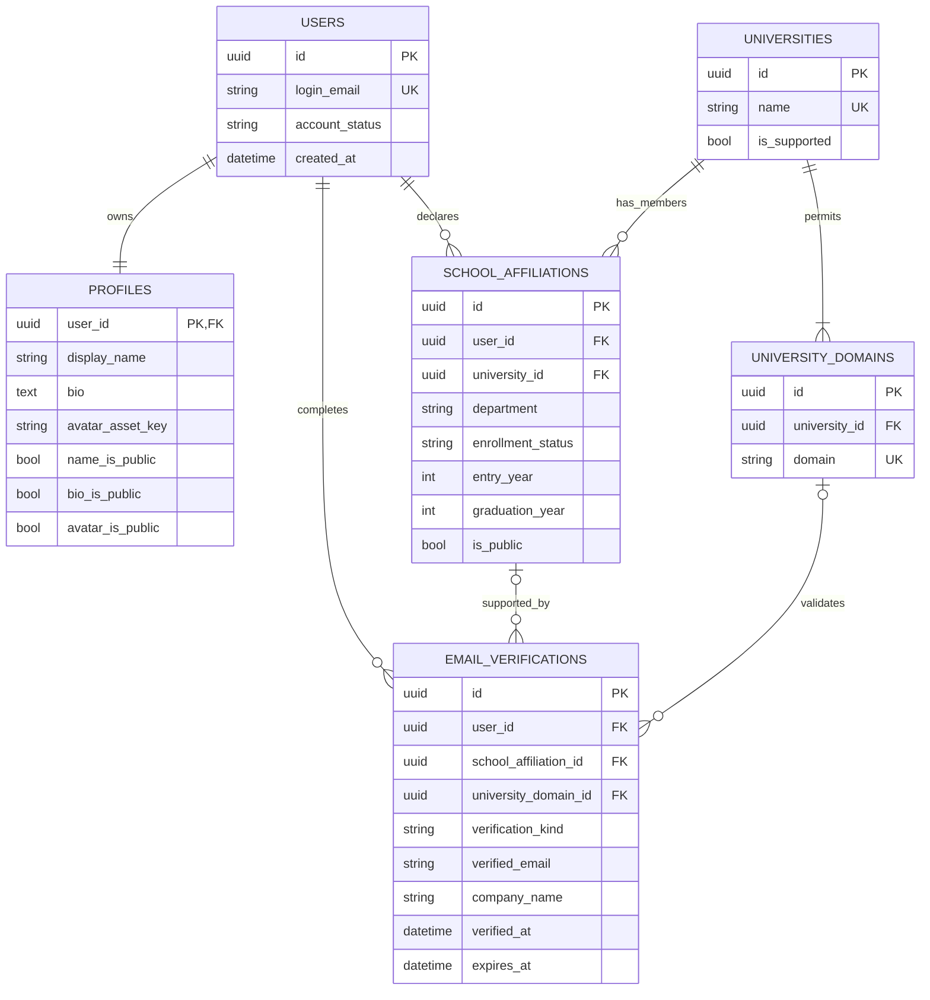
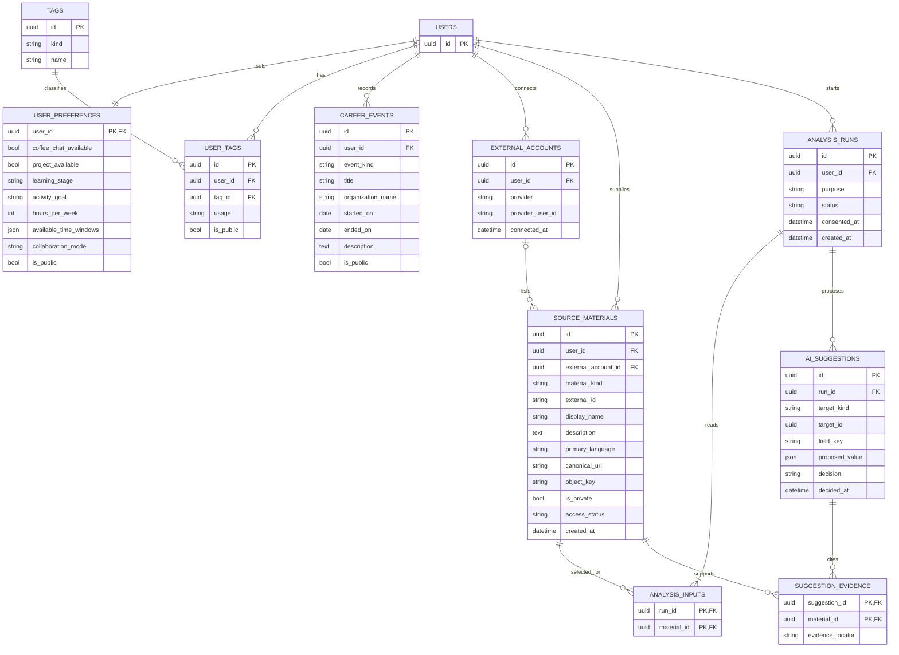
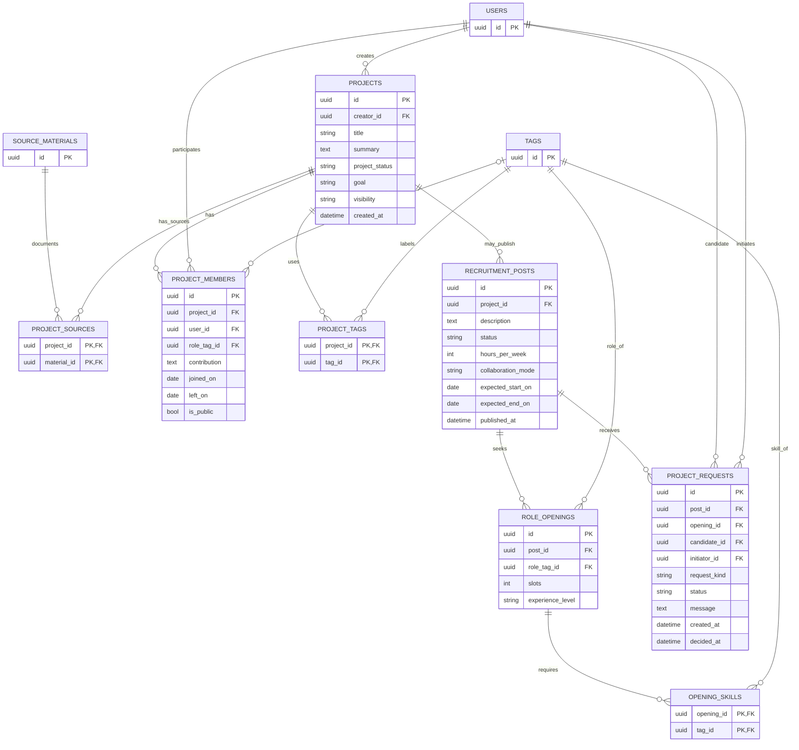
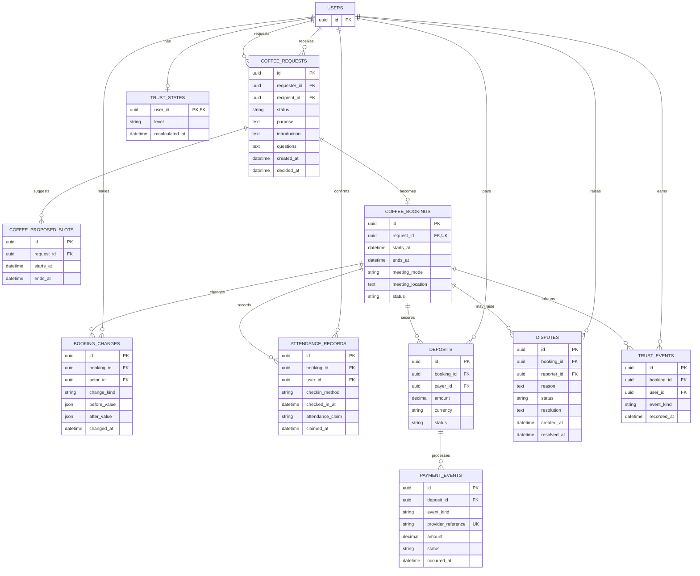
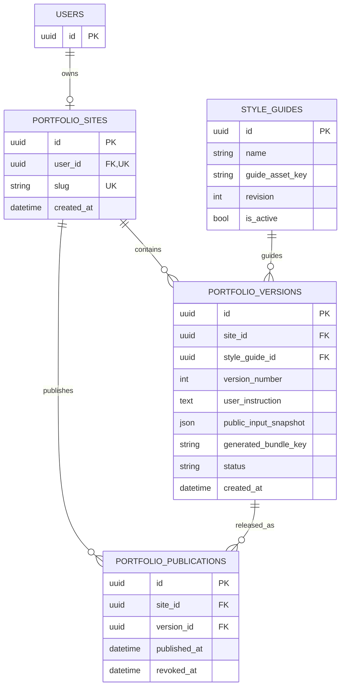

# 두드리 ERD 초안

`blueprint.md`의 기능 범위를 기준으로 정리한 **논리 데이터 모델 초안**. 데이터베이스 제품과 결제·인증 운영 정책은 미확정으로, 자료형은 개념 수준에서 표기. 각 그림에 반복 등장하는 `USERS` 등의 엔티티는 동일 테이블.

## 1. 회원·학교 인증

`SCHOOL_AFFILIATIONS`의 재학·졸업 상태는 사용자 입력 정보. 학교 이메일 인증은 해당 학교 도메인의 메일 접근 가능 여부만 증명. `EMAIL_VERIFICATIONS.verification_kind`는 `school` 또는 `company`로 구분하며, 학교 인증 시에만 학교 소속·도메인 FK 입력.

회사 인증은 회사명과 이메일 도메인을 당시의 증빙으로 기록. 직무나 과거 경력까지 검증한 것으로 취급하지 않음. 인증 코드·링크 토큰의 발급 및 만료 자료는 인증 처리용 단기 저장소에서 관리하며, 이 논리 ERD의 영속 테이블에서는 제외.

## 2. 프로필 정보·외부 자료·AI 승인

`TAGS.kind`로 `skill`, `role`, `interest` 구분. `USER_TAGS.usage`는 경험한 항목과 희망하는 항목을 구분하며, 경력이 없는 사용자도 희망 역할·관심사 등록 가능. 학교·회사·프로젝트는 각각 소속, 경력 이벤트, 프로젝트 참여로 저장. 타임라인은 승인된 사실을 조합해 구성.

GitHub 계정은 `EXTERNAL_ACCOUNTS`, 조회한 저장소와 CV·포트폴리오 URL 등은 `SOURCE_MATERIALS`에 저장. 자료 목록 조회와 분석 동의는 별개. 실제 분석 입력은 해당 실행의 `ANALYSIS_INPUTS`에 등록된 자료로 한정.

LinkedIn은 MVP에서 `SOURCE_MATERIALS`의 링크만 사용하며 계정 연동은 제외. 외부 계정 접근 토큰의 평문 저장도 제외.

`AI_SUGGESTIONS`에는 제안 상태(`pending`, `accepted`, `rejected`)와 제안 값 보관. 기존 값 변경도 별도 제안으로 취급하며, `target_id`와 `field_key`로 대상 지정. 여러 종류의 승인 대상을 참조하므로 서비스 계층에서 대상 종류와 소유자 확인 필요.

승인된 제안만 `PROFILES`, `SCHOOL_AFFILIATIONS`, `USER_TAGS`, `CAREER_EVENTS`, `PROJECTS`, `PROJECT_MEMBERS` 등에 반영. 직접 입력한 값은 재분석 결과로 덮어쓰지 않음. `SUGGESTION_EVIDENCE`는 근거 자료의 위치만 연결하며 비공개 원문의 공개 화면 복사는 제외.

## 3. 프로젝트 경험·팀원 모집

`PROJECTS`는 경험·포트폴리오 대상. 같은 프로젝트가 여러 자료에 등장하면 `PROJECT_SOURCES`로 연결. `RECRUITMENT_POSTS`는 사용자가 별도로 게시하는 팀원 모집 공고이며, 프로젝트 등록이나 GitHub 분석만으로 생성·공개되지 않음. 공동 프로젝트 URL을 추가해도 저장소 접근 권한은 자동 부여되지 않음. `PROJECT_MEMBERS.contribution`에는 각자의 실제 역할과 작업만 기록.

`PROJECT_REQUESTS.request_kind`는 `application` 또는 `invitation`. `candidate_id`는 참여 후보, `initiator_id`는 요청을 시작한 사용자. 수락된 요청만 팀원 등록으로 연결. 모집 공고 게시·초대 권한은 해당 프로젝트의 권한으로 확인.

## 4. 커피챗·예약·신뢰

요청과 확정 예약을 분리. 일정 변경은 `BOOKING_CHANGES`에 기록. 약속 시점의 체크인(`checked_in_at`)과 사후 참석 주장(`attendance_claim`, `claimed_at`)도 별도 저장. `TRUST_EVENTS`는 판단 근거 이력, `TRUST_STATES`는 현재 등급 조회용 상태. 분쟁 중인 사안은 자동 제재·정산 대상에서 제외.

보증금 납부 주체·금액·결제 시점·환불 기준과 참석 확인 방식은 `blueprint.md`에서 미정. `DEPOSITS`는 정책 확정 후 예약별로 필요한 납부 의무를 생성할 수 있는 구조. `PAYMENT_EVENTS`는 결제·취소·환불 결과 기록용이며, 카드·간편결제의 민감한 원본 정보는 저장하지 않음.

## 5. AI 포트폴리오

`PORTFOLIO_VERSIONS`의 생성 코드는 별도 저장소의 번들로 보관하고 이전 버전 유지. `public_input_snapshot`에는 생성 시점에 **승인되고 공개도 허용된** 사실만 포함. 게시 기록을 분리해 이전 버전 복구를 표현.

공개 설정 철회 시 현재 게시물의 코드·스냅샷에도 해당 사실이 남아 있을 수 있음. 게시를 즉시 중지하고 허용 자료로 재생성한 뒤 재게시 필요. 생성 코드는 서비스 본체와 분리된 실행 영역에서 제공.

## 공통 제약과 조회 규칙

| 대상 | 기본 제약 |
| --- | --- |
| 학교 도메인 | `UNIVERSITY_DOMAINS.domain`, `SCHOOL_AFFILIATIONS(user_id, university_id)` 유일. 이메일 인증 당시 선택 학교의 허용 도메인인지 확인. |
| 태그 | `TAGS(kind, name)`, `USER_TAGS(user_id, tag_id, usage)` 유일. `ROLE_OPENINGS.role_tag_id`는 역할 태그, `OPENING_SKILLS.tag_id`는 기술 태그로 검사. |
| 자료·분석 | `ANALYSIS_INPUTS(run_id, material_id)`와 외부 ID가 있는 자료의 `(user_id, material_kind, external_id)`는 유일. 분석 실행의 사용자와 자료 소유자가 같아야 하며, Private 자료에는 해당 실행의 명시적 동의와 유효한 접근 권한이 필요. |
| 제안 승인 | 미승인·거절 제안은 공개 조회와 매칭 조회에서 제외. 승인과 정형 테이블 반영은 하나의 트랜잭션으로 처리. |
| 공개와 매칭 | 승인된 정형 사실 중 `is_public=false`인 행은 매칭에는 사용 가능하지만 공개 API·추천 이유·포트폴리오 입력에서는 제외. 삭제·철회된 사실은 매칭에서도 제외. |
| 프로젝트 | `PROJECT_MEMBERS(project_id, user_id)`와 `PROJECT_SOURCES(project_id, material_id)` 유일. 모집 공고는 프로젝트당 활성 공고 하나를 기본으로 하며, 게시 상태와 프로젝트 공개 범위를 함께 검사. |
| 커피챗 | 요청자와 수신자는 달라야 함. 수락된 요청에만 예약을 만들고 `COFFEE_BOOKINGS.request_id`, `ATTENDANCE_RECORDS(booking_id, user_id)`는 각각 유일. 참석 확인은 예약 참여자만 작성 가능. |
| 결제 | `DEPOSITS(booking_id, payer_id)`, `PAYMENT_EVENTS.provider_reference` 유일로 납부 의무와 중복 웹훅을 관리. 환불·분쟁 결론과 신뢰 등급 산식은 운영 정책 확정 후 적용. |
| 포트폴리오 | `PORTFOLIO_VERSIONS(site_id, version_number)` 유일. 게시 버전은 같은 사이트에 속해야 하며 사이트별 현재 유효한 게시 기록은 하나. |

자연어 검색 조건, 추천 점수·이유, 알림 전송 작업은 우선 계산 결과 또는 작업 기록으로 취급. 영속화가 필요해지면 별도 엔티티 추가. 의미 검색용 인덱스는 검색 구현 결정 후 승인된 사실에서 생성하며, 원본 데이터의 기준 테이블로 사용하지 않음.

구현 전 확정 필요: 학교·회사 이메일 예외 인증, 보증금 정책, 체크인 방식, 신뢰 등급 산식, 원본 자료 보관 기간. 현재 ERD에는 임의의 금액·제재 기준을 고정하지 않음.
